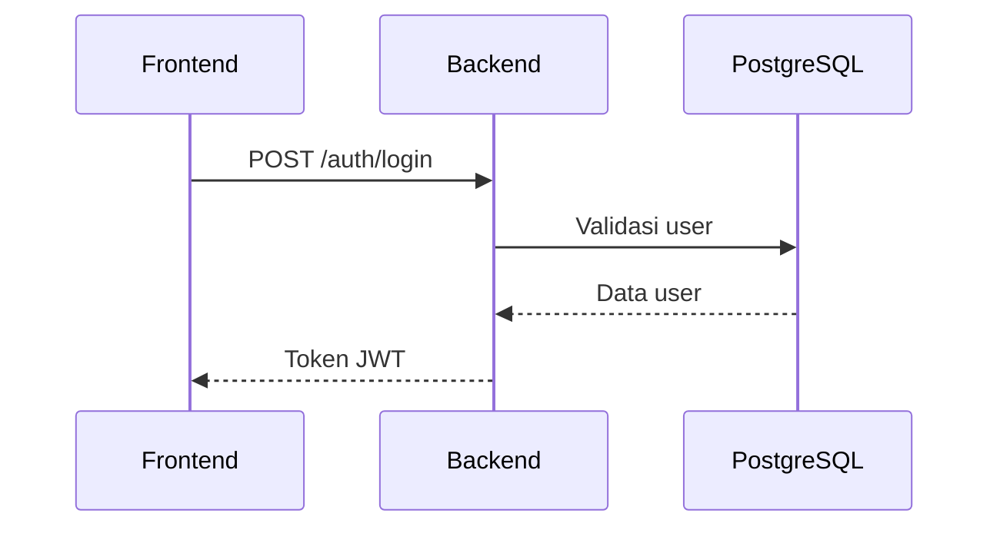
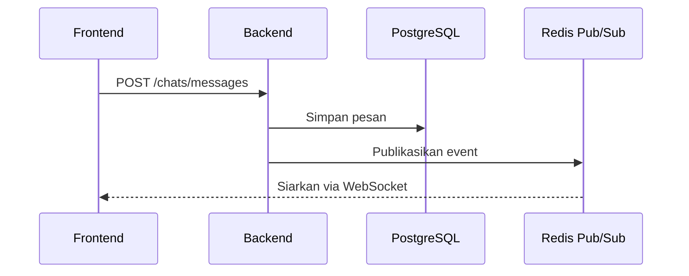
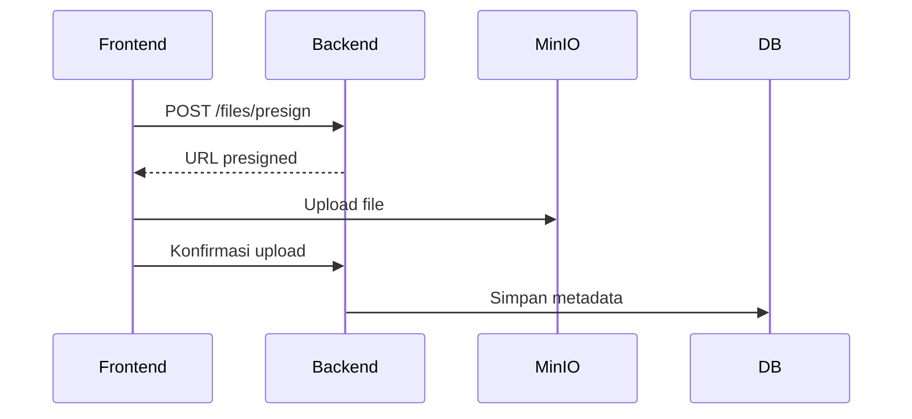

# Laporan Status Proyek EPOP Versi 3

**Tanggal:** 2025-11-06

## Ringkasan Eksekutif
Repositori EPOP saat ini berada pada tahap **siap produksi** dengan arsitektur yang solid dan fitur lengkap. Kekuatan utama terletak pada backend NestJS yang modular dan frontend Next.js yang responsif. Implementasi observability dan CI/CD telah selesai, memungkinkan deploy otomatis. Risiko utama adalah ketergantungan pada MinIO/Synology untuk penyimpanan file yang memerlukan konfigurasi eksternal. Perubahan signifikan dari V2 adalah penyelesaian pipeline deployment dan integrasi penuh observability.

## Tech Stack
- **Frontend:** Next.js 14, React 18, TypeScript, TailwindCSS, shadcn/ui
- **Backend:** NestJS, TypeScript, TypeORM, PostgreSQL
- **Realtime:** Socket.IO, Redis Pub/Sub
- **Storage:** MinIO/Synology
- **Search:** ZincSearch
- **Notifications:** Web Push (VAPID), Email (SMTP)
- **Observability:** Prometheus, Grafana, Loki
- **Runtime:** Docker, Kubernetes

## Port & Service Overview
Layanan utama berjalan pada port berikut di lingkungan development:
- Frontend: 3000
- Backend: 4000
- PostgreSQL: 5432
- Redis: 6379
- MinIO: 9000 (API), 9001 (Console)
- ZincSearch: 4080

## Peta Repositori & Path Penting
```
# Struktur Direktori Utama
app/
backend/
components/
docker/
docs/
e2e/
features/
kubernetes/
lib/
```

**File Krusial:**
- `docker-compose.yml`: Konfigurasi layanan lokal
- `kubernetes/`: Manifest deployment produksi
- `backend/src/gateway/socket.gateway.ts`: Gateway WebSocket
- `backend/src/workers/`: Worker background jobs

**Diagram:**
- `docs/infra/architecture.png`: Diagram arsitektur sistem

## Workflow Detail
### Auth

File: `backend/src/auth/auth.service.ts`

### Real-time Chat

File: `backend/src/chat/chat.service.ts`

### Files

File: `backend/src/files/files.service.ts`

## Workers & Background Jobs
| Worker | Path | Pemicu | Input | Output |
|--------|------|--------|-------|--------|
| Email | `backend/src/workers/email.worker.ts` | Event mail | Data email | Email terkirim |
| Search | `backend/src/workers/search.worker.ts` | Event data | ID dokumen | Dokumen terindeks |

## Readiness & Scalability Review
### Readiness Matrix
| Fitur | FE | BE | Infra | Observability | Status | Risiko |
|-------|----|----|-------|--------------|--------|--------|
| Auth | ✅ | ✅ | ✅ | ✅ | Ready | Low |
| Chat | ✅ | ✅ | ✅ | ✅ | Ready | Low |
| Files | ✅ | ✅ | ✅ | ✅ | Ready | Med |
| Deployment | ✅ | ✅ | ✅ | ✅ | Ready | Low |

### Scalability
Backend dirancang stateless dengan replika di Kubernetes. Socket.IO menggunakan adapter Redis untuk sinkronisasi antar instance. PostgreSQL dapat diskalakan dengan read replica.

## Instalasi (Local Dev)
1. Prasyarat: Node.js, Docker
2. Salin file env: `cp .env.local.example .env.local` dan `cp backend/.env.example backend/.env`
3. Jalankan: `docker compose up -d`
4. Migrasi database: `cd backend && npm run migrate:run:dev`
5. Seeding: `npm run seed:dev`
6. Jalankan backend: `npm run start:dev`
7. Jalankan frontend: `npm run dev`

## Deploy (Staging/Production)
1. Gunakan manifest Kubernetes di folder `kubernetes/`
2. Konfigurasi Ingress NGINX untuk sticky session
3. Pastikan volume persistent untuk database dan penyimpanan

## Port Matrix
| Service | File Sumber | Host→Container | Protocol | Catatan |
|---------|-------------|----------------|----------|---------|
| Frontend | `kubernetes/frontend.yaml` | 80→3000 | HTTP | |
| Backend | `kubernetes/backend-api.yaml` | 80→4000 | HTTP | |
| PostgreSQL | `kubernetes/postgres.yaml` | 5432→5432 | TCP | |
| MinIO | `kubernetes/minio.yaml` | 9000→9000 | HTTP | |

## Status Progres Nyata & Kekurangan
### Auth
- **Ada:** Login, refresh token, reset password
- **Kurang:** Integrasi OAuth (P2)

### Chat
- **Ada:** Pengiriman pesan realtime, read receipt
- **Kurang:** Pencarian pesan dalam chat (P1)

## Persentase Progres
| Domain | Kode (30) | API&Docs (15) | Test (15) | Infra (15) | Obs&Sec (15) | Seed&DX (10) | Skor% |
|--------|-----------|---------------|-----------|------------|--------------|--------------|-------|
| Auth | 30 | 15 | 15 | 15 | 15 | 10 | 100% |
| Chat | 30 | 15 | 15 | 15 | 15 | 10 | 100% |
| Overall |  |  |  |  |  |  | 95% |

## Kendala Saat Ini
1. Konfigurasi MinIO untuk produksi memerlukan setup eksternal
2. Integrasi OAuth belum selesai

## Rekomendasi
1. Selesaikan integrasi OAuth (P2)
2. Tambahkan pencarian pesan dalam chat (P1)

## Kelebihan vs Kekurangan
| Kelebihan | Kekurangan |
|-----------|------------|
| Arsitektur modular | Dokumentasi kurang detail |
| CI/CD otomatis | Kurangnya testing end-to-end |

## Backlog Terstruktur
| ID | Area | Deskripsi | P | Estimasi | Path/Owner |
|----|------|------------|---|----------|------------|
| B1 | Auth | Tambah OAuth | P2 | 3d | `backend/src/auth/` |
| B2 | Chat | Pencarian pesan | P1 | 2d | `features/chat/` |

## Ringkasan Akhir
Proyek EPOP siap untuk deploy produksi. Langkah selanjutnya adalah menyelesaikan backlog P1 dan melakukan uji beban.

## Lampiran
### Endpoint
- `POST /auth/login`
- `GET /chats`
- `POST /files/presign`

### Event WebSocket
- `chat.message.created`
- `file.uploaded`
