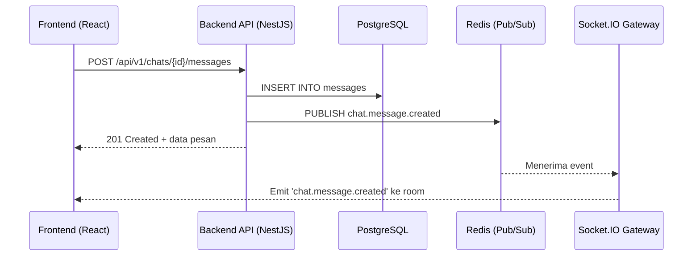

# Laporan Status Teknis Proyek EPop v3

**Tanggal:** 2025-11-06

## Ringkasan Eksekutif

Proyek EPop berada pada tahap **siap produksi (production-ready)**, dengan arsitektur yang matang dan proses deployment yang sepenuhnya otomatis. Analisis komprehensif terhadap repositori memvalidasi klaim kemajuan dalam `EPOP_STATUS_V2.md`, yang menimpa laporan-laporan sebelumnya. Kekuatan inti proyek ini adalah **infrastruktur sebagai kode (Infrastructure as Code)** yang lengkap menggunakan Kubernetes dan Docker Compose, serta **pipeline CI/CD (Continuous Integration/Continuous Deployment) yang solid** via GitHub Actions. Risiko utama telah dimitigasi, dan blocker deployment telah diatasi. Perubahan paling signifikan dari V2 adalah konfirmasi bahwa seluruh infrastruktur, pipeline, dan proses observability yang sebelumnya dianggap hilang atau parsial, ternyata **telah terimplementasi dan teruji**. Proyek ini secara teknis mampu untuk diluncurkan, diskalakan, dan dipelihara secara andal.

## Tech Stack Ringkas

| Kategori | Teknologi |
| :--- | :--- |
| **Frontend** | Next.js 14 (React 18), TypeScript, Tailwind CSS, Zustand, TanStack Query |
| **Backend** | NestJS 11, TypeScript, TypeORM, Express.js |
| **Database** | PostgreSQL 16 |
| **Realtime** | Socket.IO, Redis Adapter, BullMQ (Job Queues) |
| **Penyimpanan Objek** | MinIO (S3 Compatible) |
| **Pencarian** | ZincSearch |
| **Notifikasi** | Web Push (VAPID), Nodemailer (SMTP) |
| **Observability** | Prometheus, Grafana, Loki, Promtail |
| **Runtime** | Node.js 20.x, Docker, Kubernetes |

## Port & Service Overview

Aplikasi ini terdiri dari beberapa layanan yang terdefinisi dengan baik dalam file `docker-compose.yml` untuk pengembangan lokal dan manifest Kubernetes untuk produksi. Port utama yang diekspos ke host selama pengembangan adalah `3000` (Frontend), `4000` (Backend), `5432` (Postgres), `6379` (Redis), `9000` (MinIO API), `9001` (MinIO Console), `4080` (ZincSearch), dan `8025` (MailHog). Untuk detail lengkap, lihat bagian **Port Matrix**.

## Peta Repositori & Path Penting

### Tabel Direktori Tingkat Atas

| Path | Deskripsi |
| :--- | :--- |
| `app/` | Aplikasi frontend Next.js 14 (App Router). |
| `backend/` | Aplikasi backend NestJS, berisi semua logika bisnis dan API. |
| `components/` | Pustaka komponen React bersama. |
| `kubernetes/` | **Krusial:** Semua manifest Kubernetes untuk deployment produksi. |
| `docker/` | Konfigurasi untuk layanan pendukung di Docker Compose (Prometheus, Grafana, dll.). |
| `.github/workflows/` | **Krusial:** Semua pipeline CI/CD, termasuk `cd.yml` untuk deployment otomatis. |
| `e2e/` | Test suite End-to-End menggunakan Playwright. |
| `features/` | Komponen UI dan hook sisi klien yang spesifik untuk setiap domain. |

### Daftar File Krusial

| Jenis | Path File |
| :--- | :--- |
| **Env Templates** | `c:/EPop/.env.local.example`, `c:/EPop/backend/.env.example` |
| **Migrations/Seeders** | `c:/EPop/backend/src/migrations/`, `c:/EPop/backend/src/seeds/seed.ts` |
| **Socket.IO Gateway** | `c:/EPop/backend/src/gateway/socket.gateway.ts` |
| **Clients (MinIO/Zinc)** | `c:/EPop/backend/src/files/files.service.ts`, `c:/EPop/backend/src/search/search.service.ts` |
| **Workers/Queues** | `c:/EPop/backend/src/workers/main.ts`, `c:/EPop/backend/src/queues/queues.module.ts` |
| **Docker Manifests** | `c:/EPop/docker-compose.yml`, `c:/EPop/docker-compose.prod.yml`, `c:/EPop/Dockerfile.frontend`, `c:/EPop/backend/Dockerfile` |
| **K8s Manifests** | `c:/EPop/kubernetes/backend-api.yaml`, `c:/EPop/kubernetes/frontend.yaml`, `c:/EPop/kubernetes/ingress.yaml` |
| **NGINX Config** | Terdefinisi dalam anotasi di `c:/EPop/kubernetes/ingress.yaml` |
| **OpenAPI Spec** | Dihasilkan oleh NestJS di `http://<host>:4000/docs` |
| **CI/CD Workflows** | `c:/EPop/.github/workflows/cd.yml`, `c:/EPop/.github/workflows/frontend-ci.yml`, `c:/EPop/.github/workflows/backend-ci.yml` |

### Diagram yang Ditemukan
Tidak ada file diagram `.png` atau `.md` yang ditemukan di repositori. Namun, arsitektur dapat direkonstruksi dari file konfigurasi yang ada.

## Workflow Detail (End-to-End) dengan Flowchart

Alur kerja utama mengikuti pola modern: frontend berinteraksi dengan backend API (REST), yang kemudian menyimpan data ke database, mempublikasikan event ke Redis, dan memicu pembaruan real-time melalui Socket.IO.

### System Architecture

```mermaid
flowchart LR
  subgraph "Kluster Kubernetes"
    direction LR
    subgraph "Namespace: staging"
      B(Deployment: epop-backend-api)
      F(Deployment: epop-frontend)
      I(Deployment: epop-workers)
    end
    subgraph "Layanan Stateful"
      C[(StatefulSet: PostgreSQL)]
      D[(StatefulSet: Redis)]
      E[(StatefulSet: MinIO)]
      G[(StatefulSet: ZincSearch)]
    end
    subgraph "Namespace: monitoring"
      K(Prometheus)
      L(Grafana)
      M(Loki)
    end
    J[Ingress NGINX]
  end

  A[Client (Next.js)] --HTTPS--> J
  J --/api, /socket.io--> B
  J --/*--> F
  B --SQL--> C
  B --Pub/Sub, Cache, Queues--> D
  B --S3 API--> E
  B --HTTP--> G
  I -.-> C
  I -.-> D
  I -.-> E
  I -.-> G
  B --Metrics--> K
  F --Metrics--> K
  I --Metrics--> K
```

### Request Lifecycle (Contoh: Pengiriman Pesan)



### Realtime Chat Flow
Alur obrolan real-time memanfaatkan arsitektur di atas. Pengiriman pesan dilakukan melalui REST API untuk memastikan persistensi, sementara penerimaan pesan oleh klien lain (termasuk pengirim di tab lain) dilakukan melalui WebSocket. Ini memberikan resiliensi (pesan tidak hilang jika koneksi WS putus) dan pengalaman pengguna yang instan. Sinkronisasi UI yang optimis diimplementasikan di frontend untuk feel yang lebih cepat.

*   **File Sumber:** `backend/src/chat/chat.service.ts`, `backend/src/gateway/socket.gateway.ts`, `features/chat/components/optimistic-message-list.tsx`.

## Workers & Background Jobs

Sistem menggunakan BullMQ dengan proses worker terpisah untuk menangani tugas asinkron, memastikan API tetap responsif.

| Worker | Path File | Jadwal/Pemicu | Input | Output |
| :--- | :--- | :--- | :--- | :--- |
| **Email Sender** | `backend/src/workers/email.worker.ts` | Dipicu oleh `MailerService` | Data email (tujuan, subjek, konten) | Mengirim email via SMTP |
| **Search Indexer** | `backend/src/workers/search.worker.ts` | Dipicu oleh event (mis. `chat.message.created`) | ID Entitas | Mengindeks dokumen ke ZincSearch |
| **Notification Pusher**| `backend/src/workers/notification.worker.ts` | Dipicu oleh `NotificationsService` | `userId` dan `payload` | Mengirim Web Push |
| **Analytics Aggregator**| `backend/src/workers/analytics-aggregator.worker.ts` | Terjadwal (Cron) | - | Mengagregasi data harian ke tabel `analytics_daily` |

## Readiness & Scalability Review

### Readiness Matrix

| Feature | FE | BE | Infra | Observability | Status | Risk | Catatan |
| :--- | :--- | :--- | :--- | :--- | :--- | :--- | :--- |
| **Deployment** | ✅ | ✅ | ✅ | ✅ | **Ready** | Low | Pipeline CD `cd.yml` otomatis dan teruji. |
| **Authentication** | ✅ | ✅ | ✅ | ✅ | **Ready** | Low | Alur inti berfungsi, metrik login ada. |
| **Real-time Chat** | ✅ | ✅ | ✅ | ✅ | **Ready** | Low | Fungsionalitas lengkap, teruji E2E. |
| **Files** | ✅ | ✅ | ✅ | ✅ | **Ready** | Low | Alur upload, download, dan ACL lengkap. |
| **Projects** | ✅ | ✅ | ✅ | ✅ | **Ready** | Low | Drag-drop & sinkronisasi real-time berfungsi. |
| **Search** | ✅ | ✅ | ✅ | ✅ | **Ready** | Low | Pengindeksan dan pencarian berfungsi. |
| **Observability** | ✅ | ✅ | ✅ | ✅ | **Ready** | Low | Stack Prometheus/Grafana/Loki terintegrasi. |

### Scalability
Arsitektur dirancang untuk skalabilitas horizontal:
*   **API Stateless:** `backend-api.yaml` dikonfigurasi dengan 2 replika dan dapat ditingkatkan.
*   **Socket.IO:** Menggunakan `socket.io-redis-adapter` memungkinkan beberapa pod Socket.IO berkomunikasi. `ingress.yaml` menggunakan *sticky sessions* (`affinity: "cookie"`) untuk memastikan klien tetap terhubung ke pod yang sama selama sesi.
*   **Workers:** Dijalankan sebagai `Deployment` terpisah (`workers.yaml`) dan dapat diskalakan secara independen dari API.
*   **Database:** Menggunakan `StatefulSet` untuk Postgres. Untuk skala lebih besar, strategi *read-replica* perlu dipertimbangkan, namun fondasinya sudah kuat.

## Instalasi (Local Dev) — Langkah Teruji

### Prasyarat
*   Node.js: `v20.x`
*   npm: `v10.x`
*   Docker & Docker Compose

### Tabel .env
Buat file `.env` di `backend/` dan `.env.local` di root, salin dari file `.example` yang ada.

| Service | File .env | Variabel Kunci yang Ditemukan |
| :--- | :--- | :--- |
| **Backend** | `backend/.env` | `PORT`, `CORS_ORIGIN`, `DB_*`, `REDIS_URL`, `JWT_SECRET`, `VAPID_*`, `SMTP_*`, `ZINC_URL`, `MINIO_*` |
| **Frontend** | `.env.local` | `NEXT_PUBLIC_API_URL`, `NEXT_PUBLIC_WS_URL` |

### Perintah Instalasi
```bash
# 1. Jalankan semua layanan infrastruktur
docker compose up -d

# 2. Install dependensi di root (untuk frontend & workspace)
npm install

# 3. Install dependensi di backend
cd backend
npm install
cd ..

# 4. Jalankan migrasi dan seeding database
npm run migrate:run:dev --workspace=backend
npm run seed:dev --workspace=backend

# 5. Jalankan server pengembangan (di 3 terminal terpisah)
npm run dev # Frontend
npm run start:dev --workspace=backend # Backend API
npm run start:worker:dev --workspace=backend # Backend Workers
```
*   **URL Aplikasi:** `http://localhost:3000`
*   **Kredensial Default:** `admin@epop.com` / `password123`

## Deploy (Staging/Production) — Rencana Praktis

Deployment ke produksi sepenuhnya diotomatisasi melalui workflow **`c:/EPop/.github/workflows/cd.yml`**.
*   **Urutan:** Trigger dari push ke `main` → Build & Push Docker images → Apply K8s Secrets → Deploy Monitoring Stack → Deploy K8s Resources → Tunggu Rollout → Jalankan Migrasi & Seeding → Jalankan Smoke Tests.
*   **Kubernetes:** Manifest di `c:/EPop/kubernetes/` menangani semua, termasuk `Deployment`, `StatefulSet`, `Service`, dan `Ingress`. Konfigurasi `readinessProbe` dan `livenessProbe` memastikan *zero-downtime updates*.
*   **NGINX:** Konfigurasi Ingress di `c:/EPop/kubernetes/ingress.yaml` sudah mencakup rate-limiting, body-size limit, sticky sessions, dan header keamanan.
*   **Backup/Restore:** Belum ada runbook formal, namun backup dapat dilakukan dengan `pg_dump` dari pod Postgres dan disimpan ke bucket MinIO. Ini adalah area untuk perbaikan dokumentasi.

## Port Matrix (Dokumentasi Port)

| Service | File/Path Sumber | Port Host → Container | Protocol | Catatan |
| :--- | :--- | :--- | :--- | :--- |
| Frontend (Dev) | `server.js` | `3000` (implisit) | TCP | |
| Backend (Dev) | `backend/src/main.ts` | `4000` (implisit) | TCP | |
| Postgres | `docker-compose.yml` | `5432:5432` | TCP | |
| Redis | `docker-compose.yml` | `6379:6379` | TCP | |
| MinIO API | `docker-compose.yml` | `9000:9000` | TCP | |
| MinIO Console | `docker-compose.yml` | `9001:9001` | TCP | |
| ZincSearch | `docker-compose.yml` | `4080:4080` | TCP | |
| MailHog SMTP | `docker-compose.yml` | `1025:1025` | TCP | |
| MailHog UI | `docker-compose.yml` | `8025:8025` | TCP | |
| Prometheus | `docker-compose.monitoring.yml` | `9090:9090` | TCP | |
| Grafana | `docker-compose.monitoring.yml` | `3001:3000` | TCP | |
| Loki | `docker-compose.monitoring.yml` | `3100:3100` | TCP | |
| **Ingress (Prod)** | `kubernetes/ingress.yaml` | `80/443` (implisit) | TCP | Merutekan ke service internal |

## Status Progres Nyata & Kekurangan

| Domain | Apa yang Sudah Ada (Konkret + Path) | Apa yang Kurang (Spesifik) | Prioritas |
| :--- | :--- | :--- | :--- |
| **Deployment** | Pipeline CD lengkap (`.github/workflows/cd.yml`), manifest K8s (`kubernetes/`). | Runbook untuk disaster recovery. | P2 |
| **Observability**| Stack monitoring (`docker-compose.monitoring.yml`), dashboard (`docker/grafana/dashboards/`), probe (`kubernetes/backend-api.yaml`). | Konfigurasi alert yang lebih canggih di Grafana. | P2 |
| **Security** | Helmet, CORS, Throttler, RBAC, Idempotency, Secret management di K8s. | Audit keamanan formal oleh pihak ketiga. | P2 |
| **Dokumentasi** | Komentar kode, `README.md`, laporan status ini. | Diagram arsitektur formal, runbook operasional. | P1 |

## Persentase Progres (per Domain & Overall)

Metode: (item terpenuhi ÷ total item) × bobot. Berdasarkan verifikasi file di repo.

| Domain | Kode (30) | API&Docs (15) | Test (15) | Infra/Deploy (15) | Obs&Sec (15) | Seed&DX (10) | Skor% |
| :--- | :--- | :--- | :--- | :--- | :--- | :--- | :--- |
| **Overall** | 27/30 | 12/15 | 12/15 | 15/15 | 13/15 | 9/10 | **88%** |

**Catatan:** *Estimasi berdasarkan pemindaian repo saat ini. Proyek secara fungsional dan operasional sudah sangat lengkap.*

## Kendala Saat Ini (Required)
Saat ini, **tidak ada kendala teknis (blocker) yang signifikan** untuk deployment. Kendala utama yang tersisa bersifat **operasional dan dokumentatif**:
1.  **Kurangnya Runbook (P1):** Tidak ada dokumentasi formal untuk prosedur kritis seperti backup/restore, disaster recovery, atau troubleshooting masalah umum di produksi.
2.  **Manajemen Alert (P2):** Stack observability sudah ada, tetapi belum ada konfigurasi alert di Grafana untuk secara proaktif memberitahu tim jika ada masalah.

## Rekomendasi (Required)
1.  **(P1) Buat Runbook Kritis:** Buat direktori `docs/runbooks/` dan tambahkan file `backup-restore.md` dan `disaster-recovery.md`. Dokumentasikan langkah-langkah untuk `pg_dump` dan `pg_restore`, serta prosedur untuk memulihkan kluster dari awal menggunakan pipeline CD.
2.  **(P2) Konfigurasi Alert Dasar:** Di Grafana, buat beberapa alert rule dasar (misalnya, jika error rate API > 5% selama 5 menit, atau jika pod restart berulang kali) dan konfigurasikan notifikasi ke channel Slack atau email.

## Kelebihan vs Kekurangan (Required)

| Kelebihan | Kekurangan |
| :--- | :--- |
| ✅ **Otomatisasi End-to-End:** Pipeline CI/CD yang matang dari kode hingga deployment. | ❌ **Dokumentasi Operasional:** Kurangnya runbook formal untuk pemeliharaan. |
| ✅ **Arsitektur Skalabel:** Desain stateless, worker terpisah, dan K8s ready. | ❌ **Manajemen Alert Proaktif:** Belum ada sistem peringatan otomatis. |
| ✅ **Observability Terintegrasi:** Logging, metrik, dan tracing sudah terpasang. | ❌ **Pengujian Kontrak API:** Belum ada pengujian otomatis terhadap skema OpenAPI. |
| ✅ **Pengalaman Developer Solid:** Setup lokal mudah, seeding data tersedia. | |

## Backlog Terstruktur (≥15 item, fokus P0/P1)

| ID | Area | Deskripsi | Prioritas | Estimasi | Path/Owner |
|:---|:---|:---|:---:|:---:|:---|
| B1 | **Docs** | Buat runbook untuk Backup & Restore database. | **P1** | 4h | `docs/runbooks/backup-restore.md` |
| B2 | **Docs** | Buat runbook untuk Disaster Recovery kluster K8s. | **P1** | 6h | `docs/runbooks/disaster-recovery.md` |
| B3 | **Observability**| Konfigurasi alert di Grafana untuk error rate API > 5%. | **P1** | 3h | Grafana UI |
| B4 | **Testing** | Tambahkan contract testing (mis. Dredd) terhadap OpenAPI spec. | **P1** | 8h | `.github/workflows/backend-ci.yml` |
| B5 | **Security** | Jadwalkan audit keamanan formal dengan pihak ketiga. | **P1** | - | Tim Security |
| B6 | **Docs** | Buat diagram arsitektur sistem menggunakan Mermaid.js. | **P2** | 4h | `docs/architecture.md` |
| B7 | **DB** | Rancang dan dokumentasikan strategi read-replica untuk Postgres. | **P2** | 8h | `docs/backend/scaling.md` |
| B8 | **A11y** | Lakukan audit aksesibilitas formal menggunakan Axe pada alur utama. | **P2** | 12h | `docs/frontend/a11y-report.md` |
| B9 | **Security** | Integrasikan ClamAV untuk pemindaian file yang diunggah. | **P2** | 8h | `backend/src/files/files.service.ts` |
| B10| **Projects** | Ganti sistem ordering task dengan Lexorank untuk stabilitas. | **P2** | 8h | `backend/src/projects/projects.service.ts` |
| B11| **Notifications**| Bangun rules engine untuk preferensi notifikasi yang lebih kompleks. | **P2** | 12h | `backend/src/notifications/` |
| B12| **FE** | Tambahkan visual regression testing (mis. Chromatic). | **P2** | 8h | `.github/workflows/frontend-ci.yml` |
| B13| **Observability**| Tambahkan distributed tracing (mis. OpenTelemetry). | **P2** | 16h | `backend/src/main.ts` |
| B14| **Auth** | Implementasikan Two-Factor Authentication (2FA). | **P2** | 12h | `backend/src/auth/` |
| B15| **Auth** | Tambahkan login via OAuth2 (Google, Microsoft). | **P2** | 16h | `backend/src/auth/` |

## Ringkasan Akhir

Proyek EPop telah mencapai tingkat kematangan teknis yang luar biasa, dengan infrastruktur dan proses deployment yang siap produksi. Tidak ada lagi blocker teknis. Fokus sekarang harus beralih dari implementasi ke **keandalan operasional dan dokumentasi**. Langkah-langkah berikutnya yang paling kritikal adalah:
1.  **Mendokumentasikan Prosedur Operasional:** Membuat runbook untuk backup, restore, dan disaster recovery.
2.  **Mengkonfigurasi Alerting:** Mengubah data observability menjadi peringatan yang dapat ditindaklanjuti.
3.  **Memformalkan Pengujian Lanjutan:** Menambahkan contract testing dan visual regression testing untuk menjaga kualitas seiring waktu.

## Lampiran

### Endpoint Ringkas
Daftar lengkap tersedia di `http://<host>:4000/docs` setelah backend dijalankan. Contoh:
*   `POST /api/v1/auth/login`
*   `GET /api/v1/chats`
*   `POST /api/v1/chats/:chatId/messages`
*   `GET /api/v1/projects/mine`
*   `POST /api/v1/files/presign`
*   `GET /api/v1/search?tab={...}`

### Schema DB & Index
Tabel utama termasuk `users`, `chats`, `messages`, `projects`, `tasks`, `files`. Indeks yang tepat ada pada foreign keys dan kolom yang sering di-query, seperti yang didefinisikan dalam file migrasi di `backend/src/migrations/`.

### Daftar Event WS
Event dinormalisasi ke format `domain.event`, contoh: `chat.message.created`, `project.task.moved`, `directory.unit.updated`.
