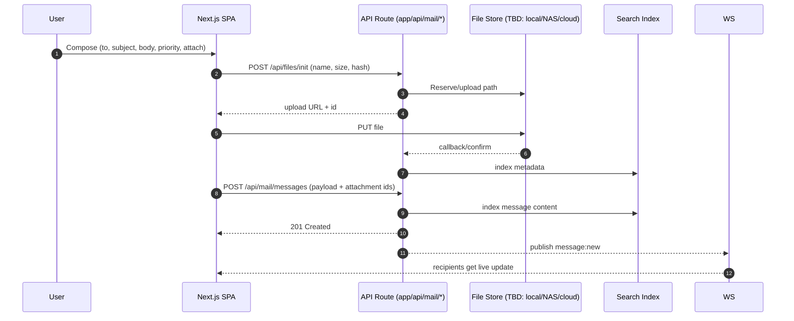
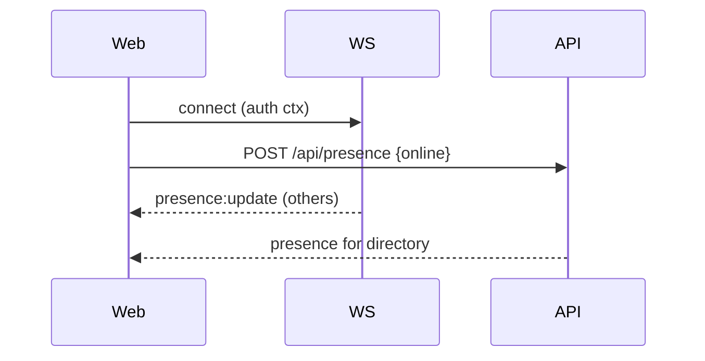
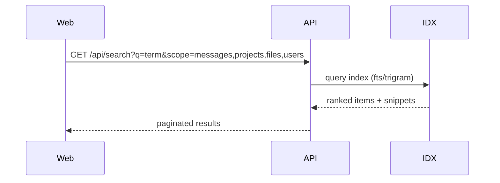
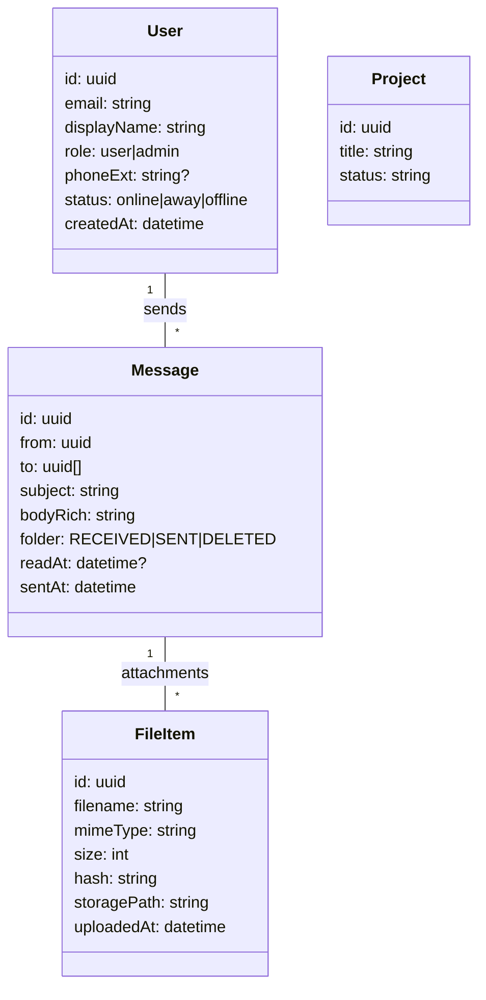

# EPOP — Project Blueprint (Repo: `HitterD/EPOP--Windsurf-`)

_Last updated: **2025-11-07** (Asia/Jakarta)_

> **Purpose**
> Create a single, authoritative blueprint driven by the **actual repo** at `https://github.com/HitterD/EPOP--Windsurf-`. Includes architecture, flows, tech stack, folder-by-folder/file-by-file review checklist, and a progress tracker tied to code and docs in this repository.

---

## 1) Executive Summary

**Goal.** Deliver a Microsoft Teams–style collaboration platform on **Next.js 14 (App Router)** with real‑time chat, mail‑like compose, projects/kanban/gantt, files, directory, notifications/PWA, presence, and **global search**.

**Primary outcomes.**
- **Real‑time Chat** with threads, reactions, read receipts.  
- **Mail‑like Compose** (Received, Sent, Deleted folders).  
- **Projects** (kanban, Gantt, task tracking).  
- **Files** (upload, preview, organize, context links).  
- **Global Search** across messages, projects, users, files.  
- **Directory** (org tree, admin‑managed).  
- **Notifications & PWA** (web push, installable).  
- **Presence** (status + phone extension badges).  

**Acceptance criteria (evidence in repo docs; verify in code):**
- Real‑time message round‑trip works (UI ↔ WS ↔ API).  
- Mail folders operate with message lifecycle.  
- Projects/Files basic flows function in UI.  
- Search returns expected entities promptly.  
- Role‑based access on server routes and UI.  
- PWA installable, offline fallbacks.  

---

## 2) High‑Level Architecture

```mermaid
flowchart TD
  U[User (Browser/PWA)] --> APP[Next.js 14 App Router]
  APP <--> WS[(Socket.IO / WebSocket)]
  APP --> API[Next.js API Routes (app/api/*)]
  API --> DB[(Data Layer: TBD – mock/in-memory now; upgradeable to Postgres/SQL Server)]
  API --> FS[(File Storage: local/NAS/Cloud TBD)]
  API --> IDX[(Search Index: Postgres FTS / Adapter TBD)]
  API --> LOG[(Observability: logs + LHCI)]
  subgraph Infra
    DB
    FS
    IDX
    LOG
  end
```

**Notes**
- Server endpoints are colocated under `app/api/*` (per README structure).  
- `server.js` present for custom Node/WS bootstrap; Socket.IO for realtime.  
- Search initially DB/FS backed; adapter pattern leaves room for Elastic later.

---

## 3) Core Flows

### 3.1 Send Message with Attachment


### 3.2 Presence


### 3.3 Global Search


---

## 4) Tech Stack (from repo README)

- **Framework**: Next.js 14 (App Router)  
- **Lang**: TypeScript  
- **Styling/UI**: Tailwind CSS + shadcn/ui, lucide icons  
- **State**: Zustand  
- **Data Fetching**: TanStack Query (React Query)  
- **Realtime**: Socket.IO  
- **Forms/Schema**: React Hook Form + Zod  
- **Charts**: Recharts; **Calendar**: React Big Calendar  
- **Grid/Gantt**: SVAR DataGrid & Gantt (planned)  
- **Rich Text**: TipTap  
- **Testing**: Playwright + React Testing Library; Jest config present  
- **Storybook**: Component docs  
- **Perf**: Lighthouse CI config present (`.lighthouseci/`, `lhci/`, `lighthouserc.json`).

---

## 5) Repository Structure (observed)

**Top‑level directories** (from repo root):
```
.github/workflows  | CI pipelines
.lighthouseci      | Lighthouse CI data
.storybook         | Storybook config
app                | Next.js App Router (auth, shell, API)
backend            | (placeholder/legacy, investigate)
components         | UI components (shell/ui/providers)
docker             | Docker artifacts
docs               | Project docs & status markdowns
e2e                | Playwright E2E
features           | Feature modules (chat/compose/projects/files/directory/...)
kubernetes         | Deployment manifests
lhci               | Lighthouse CI scripts/config
lib                | api client, stores (Zustand), socket, utils, db (mock)
messages           | (message stubs or seeds – verify)
public             | Static assets
stories            | Storybook stories
tests/visual       | Visual regression setup
types              | Shared TS types
```

**Key root files**
```
.env.local.example, .eslintrc.json, .prettierrc, .gitignore
Dockerfile.frontend, docker-compose.yml, docker-compose.prod.yml, docker-compose.monitoring.yml
README.md, QUICK_START*.md, INSTALLATION.md, SETUP.md
STATUS/SESSION/WAVE/IMPLEMENTATION*.md (progress/status docs)
i18n.ts, middleware.ts, next.config.js, server.js
jest.config.js, jest.setup.js, playwright*.ts
postcss.config.js, tailwind.config.ts, tsconfig.json
package.json, package-lock.json
```

> **Note:** Nested file details per folder are tracked in the **Review table** (Section 19). Where code wasn’t accessible via the browser, items are marked **TBD** with actions to verify locally.

---

## 6) Domain Model (initial)



---

## 7) API Surface (expected by structure)

- `app/api/auth/*` — login/register/refresh/logout.  
- `app/api/chats/*` — threads, reactions, receipts.  
- `app/api/mail/*` — messages, folders (Received/Sent/Deleted).  
- `app/api/projects/*` — boards, tasks, gantt data.  
- `app/api/files/*` — upload/init/complete/download, previews.  
- `app/api/search` — multi‑entity search (messages/projects/files/users).  
- `app/api/presence` — set/get presence.  

> **Status:** verify actual route files under `app/api/*` locally; add exact endpoints and DTOs.

---

## 8) Frontend Architecture

- **Routing:** App Router with segmented routes `(auth)` and `(shell)`; features mounted under `dashboard/`, `chat/`, `mail/`, `projects/`, `files/`, `directory/`.
- **State:** Zustand stores for session/theme/presence; React Query for server cache.
- **UI:** Tailwind + shadcn/ui; providers colocated under `components/providers`.
- **Theme:** dark/light persisted; system‑pref aware.
- **Error boundaries:** per feature; toasts for transient errors.

---

## 9) Realtime & Presence

- **Socket.IO** client in `lib/socket`; server via `server.js` or Next.js Route Handler upgrade.  
- Presence broadcast over user & room channels; handle reconnect replay.

---

## 10) Search Design

- **Indexer:** on message/file commit, normalize content and index (DB FTS/trigram).  
- **Ranking:** subject and exact matches weighted higher; paginate.  
- **Snippets:** server‑side excerpts with highlights.  
- **Adapter:** allow swap to Elastic/OpenSearch later.

---

## 11) Files & Storage

- **Pathing:** content‑addressed by `sha256`, organized by date buckets.  
- **Validation:** size/mime allowlist; antivirus hook (optional).  
- **Streaming:** range requests, signed URLs when applicable.  
- **TBD:** confirm current storage target (local vs NAS vs cloud) in this repo.

---

## 12) Security & Compliance

- JWT secret via `.env.local`; middleware route guards; RBAC.  
- CSRF (if cookie‑based); strict CORS origins.  
- Rate limit on auth/search; audit trails for admin.

---

## 13) Performance Budgets

- Route TTI ≤ 2.0s; route transition ≤ 150ms.  
- Search P95 ≤ 200ms (warm), ≤ 500ms (cold).  
- Message send P95 ≤ 300ms (excl. upload).  
- Lighthouse CI thresholds stored in repo (tune `.lighthouseci`).

---

## 14) Testing Strategy

- **Unit**: stores, utils, DTO validators.  
- **Integration**: API handlers with mock DB/FS.  
- **E2E**: Playwright flows (compose→send→receive→search; project/task happy path).  
- **Visual**: `tests/visual` snapshots.  
- **Storybook**: per component stories in `/stories`.

---

## 15) DevEx, CI/CD & Environments

- **CI**: `.github/workflows` for lint/test/build/LHCI (verify jobs).  
- **Docker**: `Dockerfile.frontend`, `docker-compose*.yml` present.  
- **Kubernetes**: manifests under `/kubernetes` (review for secrets/ingress).  
- **Envs**: `dev`, `staging`, `prod` via env files and compose overrides.

---

## 16) Accessibility & UX

- Keyboard navigation, focus outlines, ARIA roles (see `ACCESSIBILITY_AUDIT.md`).  
- Reduce motion toggle; skeletons; optimistic updates.

---

## 17) Risks & Mitigations

| Risk | Impact | Likelihood | Mitigation |
|---|---:|:---:|---|
| Realtime disconnects / drops | Missed events | Med | Ack/retry; replay on reconnect; WS ping/pong |
| Search quality/latency | Poor results | Med | Add trigram; telemetry; caching |
| Route guard/hydration | Blank screens | Med | Guard SSR‑safe, hydration tests |
| Large files | Slow uploads | Med | Chunked upload; size caps; background indexing |
| PWA offline gaps | Broken UX offline | Low–Med | Add route‑level fallbacks & cache strategies |

---

## 18) Roadmap & Progress Tracker

> **Legend**: ✅ Done · 🟡 In Progress · 🔲 Planned · ❗ Bug/TBD

**Features**
- Real‑time chat — 🟡 (socket client/server present; verify threads/reactions/receipts)  
- Mail‑like compose & folders — 🟡 (routes/UX present; verify persistence)  
- Projects (kanban/gantt) — 🔲 (SVAR planned)  
- Files upload/preview — 🟡 (routes present; verify storage target)  
- Global search — 🟡 (endpoint placeholder; verify indexing)  
- Directory (org tree/admin) — 🔲 (scaffold)  
- Notifications & PWA — 🟡 (PWA scaffold; push TBD)  
- Presence — 🟡 (status in UI; verify WS updates)  

**Evidence sources in repo**: README feature list; numerous status docs (`*_STATUS_*`, `WAVE_*`, `SESSION_*`).

**Verification gates**
- E2E chat round‑trip on staging ✅/🔲  
- Search latency within budget 🔲  
- RBAC on admin routes 🔲  
- PWA install & offline fallback pass 🔲  

---

## 19) Folder‑by‑Folder Review — Inventory & Actions

> **Method**: The GitHub web UI limited deep file viewing in some folders; we enumerate **all visible root items** and mark any nested review as **TBD** to complete locally. Use Section 20 scripts to auto‑generate a full tree and paste under **19.1**.

### 19.1 Inventory (paste full tree here)
```
# Paste output from:  
#   tree -a -I "node_modules|.git|dist|build"  
# or scripts/repo-inventory.mjs (Section 20.1)
```

### 19.2 Review table

| Path | Purpose | Key Exports / Routes | Tech Debt | Tests | Action |
|---|---|---|---|---|---|
| .github/workflows/ | CI pipelines | Lint/Test/Build/LHCI (verify) | Ensure caching, fail‑fast | – | Open & verify jobs |
| .lighthouseci/ | Lighthouse CI data | LHCI settings/artifacts | Keep budgets in code | – | Tune thresholds |
| .storybook/ | Storybook config | Stories in `/stories` | Ensure CSF3, a11y addon | – | Run SB & add coverage |
| app/ | Next.js App Router | `(auth)`, `(shell)`, `api/*` | Confirm route guards | ☐ | **TBD: list nested files** |
| backend/ | Legacy/alt backend | n/a | Clarify usage or remove | – | Decide keep/remove |
| components/ | UI libs | `shell/`, `ui/`, `providers/` | Enforce design tokens | ☐ | Inventory components |
| docker/ | Docker artifacts | compose overrides | Keep images slim | – | Verify healthchecks |
| docs/ | Documentation | status, guides | Dedup overlaps | – | Index docs in README |
| e2e/ | Playwright tests | flows/specs | Expand critical paths | ✅/☐ | Review coverage |
| features/ | Feature modules | chat/compose/projects/etc | Boundaries & colocation | ☐ | Inventory & link to routes |
| kubernetes/ | K8s manifests | deploy, svc, ingress | Secrets mgmt | – | Verify manifests |
| lhci/ | LHCI scripts | CI integration | Pin versions | – | Run in CI |
| lib/ | Client libs | `api/`, `stores/`, `socket/`, `db/`, `utils.ts`, `constants.ts` | Avoid cross‑deps | ☐ | Audit APIs & tests |
| messages/ | Message assets? | seeds/templates? | Clarify role | – | Decide keep/merge |
| public/ | Static assets | icons, manifest | PWA assets complete | – | Verify manifest/sizes |
| stories/ | Storybook stories | `*.stories.*` | Co‑locate per feature | – | Add MDX docs |
| tests/visual/ | Visual tests | screenshots/config | Flake handling | ✅/☐ | Stabilize thresholds |
| types/ | Shared TS types | domain DTOs | Enforce strict TS | – | Add type tests |
| .env.local.example | Env sample | JWT_SECRET, flags | Add comments | – | Keep synced |
| Dockerfile.frontend | Container build | multi‑stage | Cache deps layer | – | Check image size |
| docker-compose*.yml | Orchestration | dev/prod/monitoring | Health & secrets | – | Smoke test |
| README.md | Top overview | features, stack, structure | Keep authoritative | – | Sync with code |
| ACCESSIBILITY_AUDIT.md | a11y doc | audits & fixes | Keep updated | – | Run axe/lhci |
| IMPLEMENTATION_* | Status docs | phase/wave summaries | Deduplicate | – | Link to tracker |
| QUICK_START*.md | Getting started | run steps | Ensure accuracy | – | Keep minimal |
| INSTALLATION.md/SETUP.md | Bootstrapping | prerequisites | Merge overlap | – | One source of truth |
| i18n.ts | i18n config | locales | Lazy‑load bundles | ☐ | Add tests |
| middleware.ts | Edge middleware | auth/headers | SSR‑safe guards | ☐ | Add tests |
| next.config.js | Next config | images, headers | Security headers | – | Review & harden |
| server.js | Custom server | Socket.IO binding | Logging, CORS | ☐ | Verify lifecycle |
| jest*.js | Jest config/setup | testing env | Align with TS | – | Keep simple |
| playwright*.ts | Playwright config | e2e runner | Trace on fail | – | Tune retries |
| postcss.config.js | CSS tooling | Tailwind pipeline | n/a | – | OK |
| tailwind.config.ts | Theme/tokens | design system | Enforce tokens | – | Docs in /docs |
| tsconfig.json | TS config | strict mode | Enable strict | – | Review paths |
| package.json | Scripts/deps | build/test/lhci | Prune deps | – | Add `pnpm`/`npmrc` |

**Per‑file checks**
- [ ] Naming & colocated tests  
- [ ] Lint/TS errors  
- [ ] DTO validation & guards  
- [ ] Error handling & logs  
- [ ] Secret leakage (envs, tokens)  
- [ ] Accessibility (labels, roles)  

---

## 20) Scripts — Repo Audit Helpers

### 20.1 Node.js: file tree + sizes + ts/tsx detection
```bash
node scripts/repo-inventory.mjs > docs/repo-inventory.json
```
```js
// scripts/repo-inventory.mjs
import { readdir, stat } from 'node:fs/promises';
import { join, extname } from 'node:path';

async function walk(dir, acc=[]) {
  const entries = await readdir(dir, { withFileTypes: true });
  for (const e of entries) {
    if (["node_modules", ".git", "dist", "build"].includes(e.name)) continue;
    const p = join(dir, e.name);
    if (e.isDirectory()) await walk(p, acc);
    else {
      const s = await stat(p);
      acc.push({ path: p, size: s.size, ext: extname(p) });
    }
  }
  return acc;
}

const data = await walk(process.cwd());
console.log(JSON.stringify(data, null, 2));
```

### 20.2 Secret scan (simple grep)
```bash
rg -n --hidden --glob '!node_modules' '(AKIA[0-9A-Z]{16}|-----BEGIN (PRIVATE KEY|RSA PRIVATE KEY)|password[[:space:]]*=)'
```

---

## 21) Environment & Config Matrix (from repo)

| Key | Dev | Staging | Prod | Notes |
|---|---|---|---|---|
| JWT_SECRET | ✔︎ | ✔︎ | ✔︎ | From `.env.local.example` / README |
| NEXT_PUBLIC_ENABLE_REGISTRATION | ✔︎ | ✔︎ | ✔︎ | Feature flag |
| SOCKET_IO_ORIGIN | ✔︎ | ✔︎ | ✔︎ | Match CORS |
| STORAGE_ROOT / BUCKET | ✔︎ | ✔︎ | ✔︎ | Pick local/NAS/cloud |

---

## 22) Contributing & Conventions

- Conventional commits; PRs include tests & docs.  
- ESLint + Prettier enforced; CI blocks on lint/test.  
- Keep this `BLUEPRI